# Results of the best-performing CNN model

This document summarizes all important results of the best-performing model. The goal is to find out whether and if yes, by how much and why the position of the SHAP values and the important LIME segments changes after image augmentation.


## Model overview

The best performing CNN (found under ```results/model/checkpoint-50ep-2024-11-20-17-00-09.tar```) has the following layers:

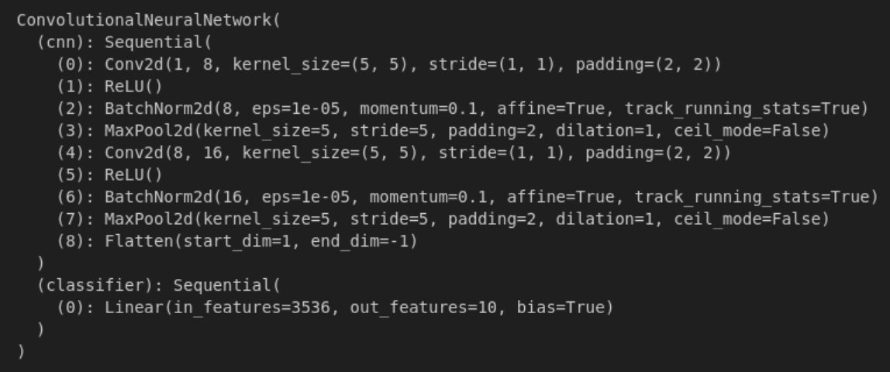

It was trained using the following set of hyperparameters (already the default in ```train_cnn.ipynb```) and other relevant data:

* Adam optimizer
* Learning rate = 3e-4
* Weight decay (L2 Loss) = 1e-4
* 50 Epochs
* Batch Size = 20
* Loss Function: Cross Entropy Loss
* Train/Test split, i.e. 99 samples per each of the 5 classes (404*303 pixels)
* Data augmentation
    * 50% chance of horizontally flipping the image
    * 50% chance of vertically flipping the image
    * Rotation anywhere between -30° and 30°


## Prediction Accuracy and Distributions

The confusion matrix of the model gives an overview of its performance on the testing (89% accuracy) and training (98.38% accuracy) dataset:

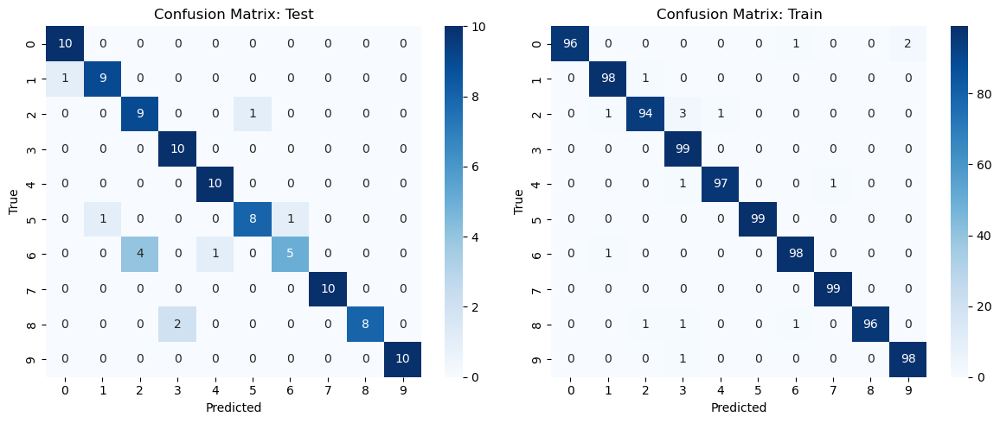

* This suggests that the model, while performing pretty well on new data, is still overfitted on the training data.
* Specifically the 6th class seems to be often confused with the 2nd class.
* The 8th class is also sometimes predicted as the 3rd class.
* Both of these problems are however only present in the testing dataset and only in one direction, suggesting that the model is unlikely struggling with distinguishing between [2 and 6] and [3 and 8], as there are no errors made the other way around.

Therefore, these two class pairs will be analyzed in the next section.


## LIME analysis of the badly classified classes

### 2nd and 6th class comparison

Let us first take a look at the LIME explanations for the label predictions of the 6th class.
As we can see, the model oftentimes focuses on areas that belong to the background of the image. However, it does not always result in a wrong prediction, like in the bottom-left image or the two right pictures. However in other images, like in the bottom-middle or bottom-middle-right images, the strong focus on the background coincides with the wrong prediction.

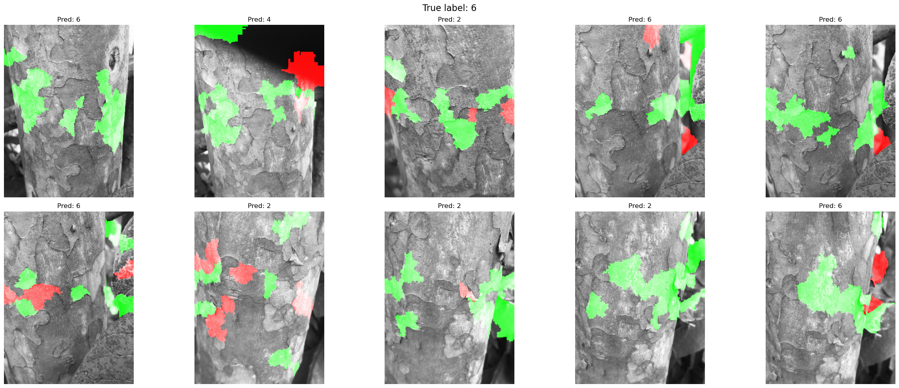

The 2nd class images don't have any visible background. Due to this the model only focuses on the bark itself. The model is also further capable of correctly classifying all of the images.

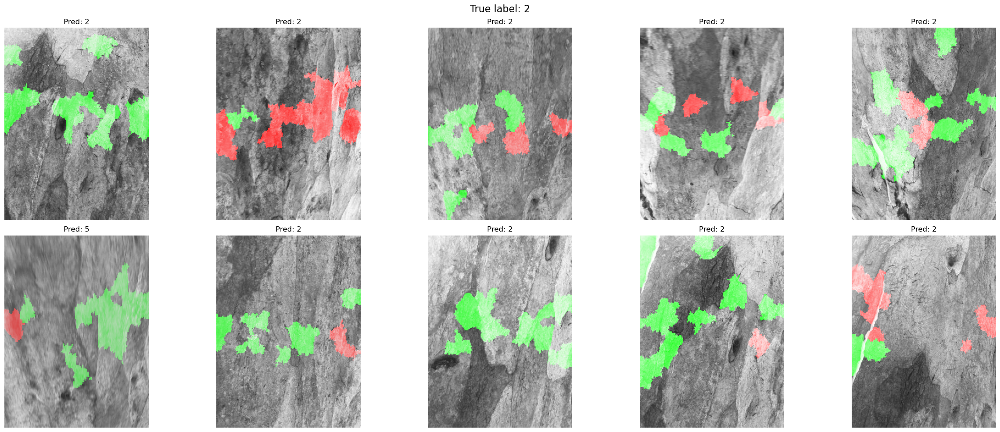

It seems like this is due to the model mistakingly interpreting the darker background of the images as darker bark spots. Since it is not the case with the training dataset it may be quite likely that this is due to overfitting on the training dataset.

### 3rd and 8th class comparison

The 8th class doesn't have the same issue the 6th class has where the background distracts the model from the important image parts.
There is nothing specific that can be seen in the two bottom-left images that might explain why they are classified as the 3rd class; except maybe for the similarity that is visible to the human eye: the fine white lines along a somewhat dark, smooth bark.

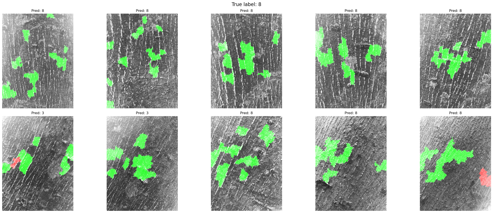

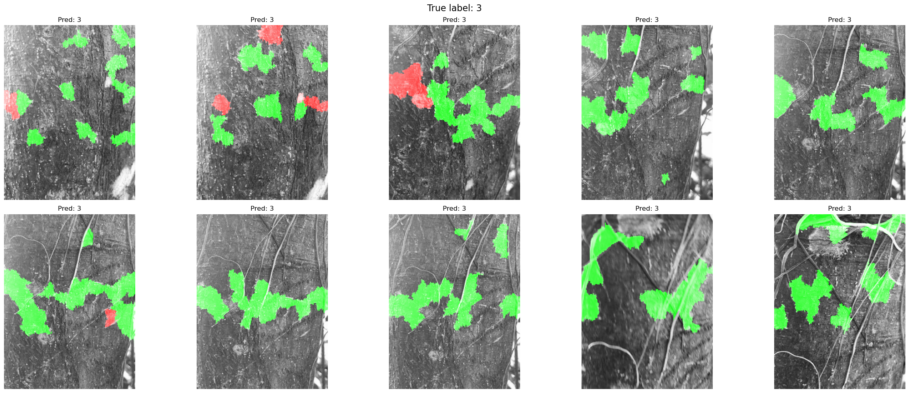


## Image augmentation and Heatpoint changes analysis

Now that we've established some general points about the model, like how it is susceptible to mistaking the background as important information and badly distinguishing between the bark texture of some classes, let us see if, how and why this changes after augmenting these images.

### Augmented image order convention

All of the images chosen for augmentation are the first of their class, i.e. the top-left images of the pictures above, for LIME and the second of their class, i.e. the top-middle-left, for SHAP. The following describes the appearance order of the image's augmentation variations:

1. Original, unaugmented image
2. Image with additional Gaussian Noise
3. Image rotated by 30°
4. Image with small 100*100 pixels black square overlay
5. Image with bigger 200*200 pixels black square overlay

The SHAP evaluation images show the input images on the left. The images to their right display the SHAP values for each of the 10 possible classes, from class 0 (right next to the input images) to class 9 (at the very right).

Note 1: The SHAP library made the individual images very small. Since it is barely visible in the zoomed out state, feel free to open the original images and zoom in on them instead. I apologize for the inconvenience.

Note 2: Furthermore, due to using the ```DeepExplainer``` of the SHAP library, I am using DeepSHAP (DeepLIFT + SHAP), which also approximates SHAP values, but in a computationally less expensive way because it utilizes the fact that it's working on a DL model, thus already knowing some of the intricacies of the model's design [1, 2].

### Augmented LIME analysis

The augmentation of the 6th class shows the most drastic changes to the location of the most important LIME segments with the overlay of the big black square, while after the addition of Gaussian Noise or the small black square the most important segments seem to stay in the same general area. However interestingly, the model's prediction only remains correct after the 30° rotation. This is likely due to the model's familiarity with this kind of augmentation.

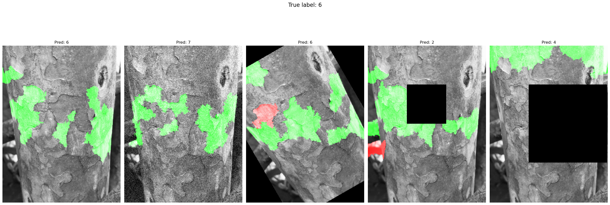

The 8th class' distribution of the most important LIME segments after augmentation is similar to the previous class. However, the predictions seem to be mostly correct, except for the overlay with the big black square. This is most likely due to the model having less information, in specifically the points that are most important for the model's decision in the unaugmented version. However, the bigger black square also changed how important the model viewed the segments next to it; and instead choosing to only focus on the top of the image.

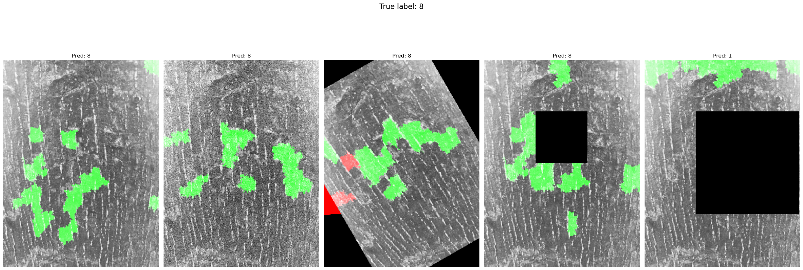

The augmentations of the 2nd and 3rd classes seems to follow a similar pattern: the biggest black square moves all of the important LIME segments to the top of the image while the others only influence it barely. The accuracy of the model seems to also decline the most when faced with Gaussian noise or the obstruction by the bigger black square.

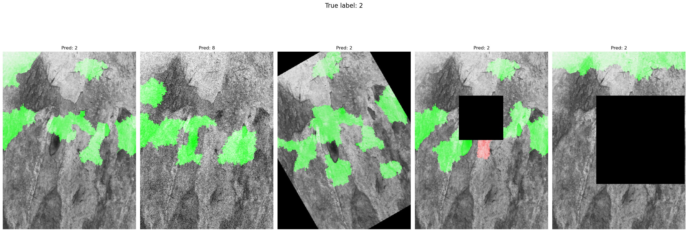
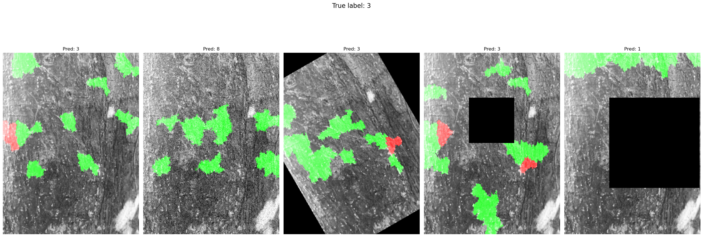

Since Gaussian Noise throws the model off and, in the majority of the cases, leads to a wrong prediction, it may be that the model is looking for finer patterns in the bark to make its prediction.

Furthermore, the blacked out parts of the image are very rarely interpreted as very important by the model. This may suggest that due to training on partially rotated images, the model learned that a pure black area is not connected to any specific class; this may also explain why the black squares are also ignored, despite not having been part of the training images' transformations.

### Augmented Deep SHAP analysis

Starting off with augmented class 6, we can already see that every single image (unaugmented and each augmentation) has been predicted as the wrong class by the model; but interestingly as different wrong classes.

Zooming in on the unaugmented image's SHAP values for class 4 and 5, we see that the positive SHAP values are distributed along the whole picture.
The Gaussian Noise augmentation strengthens this observation; with displayed SHAP values being generally more numerous, but less bright as opposed to the unaugmented image.
The rotated image overall has way fewer SHAP values compared to the original image, which is very peculiar.
The two images with the squares have a lot of positive and negative SHAP values inside the square space.

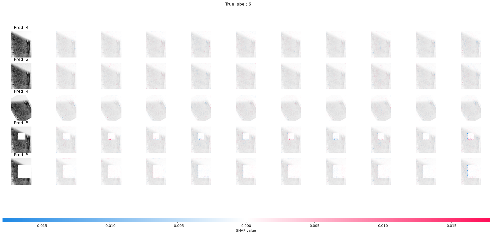

The SHAP values of the 8th class indicate that the image's texture (many vertical lines) was most important in the unaugmented image.
After the addition of the Gaussian Noise, 30° rotation, the smaller or the bigger square, we see how the pattern becomes more subdued as opposed to the original.

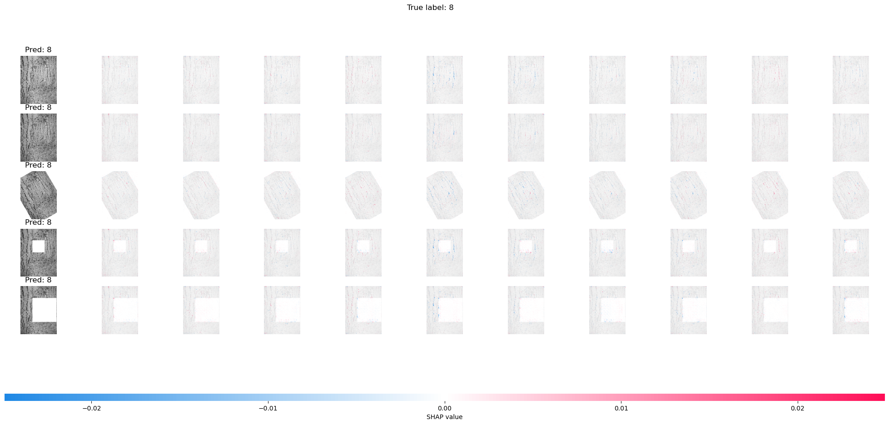

Since the SHAP Explainer is, by definition, an approximation of the model [3] that may be the reason, why the white squares contain a lot of SHAP values. We can see this exceptionally well in the 6th class, in the image with the biggest white square for the possible classes 4, 6, 7 and 9. We can clearly see how the SHAP values are distributed along where the explanation model expects a tree trunk to be, but instead there is just a white square, without any kind of important information. Looking at the SHAP values for each class' image with a big square, specifically for the predicted label 6, a slight red line is always visible. This is also in accordance to most training images for class 6: they are usually portrayed in images where the trunk is rather narrow with a lot of the background visible. The model may have therefore determined that a trunk's visible boundary is a core feature of the 6th class.
Since many of the test images of the 6th class did not have this same feature this may also be an explanation of why this specific class was performing this badly on the testing dataset.


## Layer activation maximization

Looking at the activations of the two ReLU layers, we also see that they are maximized on very fine patterns, supporting the thesis that Gaussian Noise has a big effect on the model's prediction as well as the moved placements of the most important LIME segments and more distributed SHAP values.

Some of the Filters however also seem to look more like noise than an actual pattern, supporting the overfitting thesis.

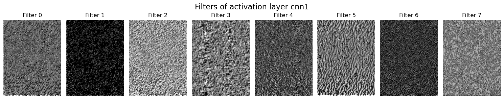
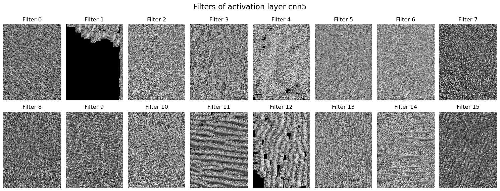


## Citations
[1] https://proceedings.neurips.cc/paper_files/paper/2017/file/8a20a8621978632d76c43dfd28b67767-Paper.pdf

[2] https://shap.readthedocs.io/en/latest/example_notebooks/image_examples/image_classification/PyTorch%20Deep%20Explainer%20MNIST%20example.html

[3] https://cgarbin.github.io/machine-learning-interpretability-feature-attribution/
